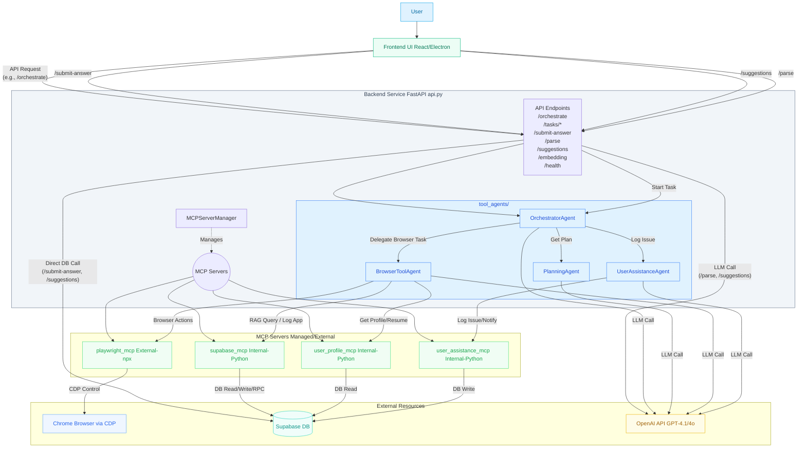

# EZ-Career: Autonomous Job Application Service (Backend)

**Tired of the endless grind of finding and applying for jobs?** Manually searching countless job boards, tailoring applications, and filling repetitive forms consumes hours daily and leads to burnout.

**EZ-Career introduces a state-of-the-art backend service powering an autonomous job application system.** Leverage the power of a sophisticated multi-agent AI to manage your job hunt efficiently, reduce stress, and put your application process on autopilot. Simply interact with our user-friendly frontend UI (developed separately), and let the agents handle the hard work!

## Overview

This service utilizes a cutting-edge **multi-agent architecture**, moving beyond simple scripts to provide intelligent, adaptive automation. Instead of a single AI, a team of specialized agents collaborates, orchestrated by a central planner, embodying the powerful **Agent-as-Tool** pattern.

* **Goal:** To fully automate the job search and application process, primarily targeting platforms like LinkedIn and associated Applicant Tracking Systems (ATS).
* **How it Works:** The user interacts with a dedicated frontend application. The frontend communicates with this backend API, typically initiating tasks via the `/orchestrate` endpoint. The backend's Orchestrator Agent then delegates tasks to specialized agents (like the BrowserToolAgent) which use various tools (MCP Servers) to interact with web browsers, databases (Supabase), and user profile data to find and apply for jobs autonomously.
* **Key Benefit:** **Save hours daily** during your job search. Enable application to potentially **hundreds of jobs per day**, even while you're away. Discover unexplored opportunities based on your profile analysis.

## ✨ Key Features & Innovations

* **🚀 Full Job Application Automation:** End-to-end process handling – from searching job boards (like LinkedIn) to navigating application forms, filling details factually, uploading resumes, verifying submission, and logging success.
* **🤖 Sophisticated Multi-Agent System:** Utilizes specialized agents (Orchestrator, Browser, Planning, User Assistance) working collaboratively via the **OpenAI Agents SDK** and the **Agent-as-Tool** pattern. (**Innovation**)
* **🧠 Dynamic Planning & Execution:** Employs agents capable of dynamic, multi-step planning and execution, adapting to the complexities of online applications and handling errors gracefully.
* **🌐 Intelligent Browser Automation via Playwright MCP:** Leverages the robust **Playwright** framework through its MCP server for precise browser interaction (navigation, clicks, form filling, file uploads), ensuring reliable automation on complex web applications. (**Microsoft Technology Alignment**, **Innovation**)
    * *Note:* Playwright MCP was chosen over alternatives like `Browser_use` for its superior control, tracing capabilities, and reliable feature implementation (e.g., file uploads).
* **🛡️ Responsible AI & Human-in-the-Loop:**
    * **Fact-Based Filling:** Agents are constrained to use only factual data retrieved from the user's profile and resume via dedicated tools.
    * **No Hallucination:** Explicitly designed *not* to invent answers for factual fields (e.g., experience levels, specific dates).
    * **User Feedback Loop:** When required factual information is missing, the system logs a specific question for the user via the `UserAssistanceAgent` and the `/submit-answer` API allows the user (via the frontend) to provide the answer. (**Usability**, **Responsible AI**)
* **🔍 RAG for Personalized & Consistent Applications:**
    * Integrates a **Retrieval-Augmented Generation (RAG)** system using **Sentence Transformers** (`thenlper/gte-small`) embeddings and **direct Supabase RPC function calls** (`match_application_issues_384`).
    * This allows the agent to find and reuse previously provided user answers for similar factual questions encountered in new applications, ensuring consistency and reducing redundant user prompts. (**Innovation**, **Usability**)
* **💾 Supabase Backend Integration:** Extensive use of Supabase for storing user profiles, resume text/URLs, application tracking data, logged issues requiring user attention, user answers with embeddings, and user notifications.
* **⚙️ Centralized YAML Configuration:** Easily define and manage agents, their instructions, models, and required MCP server connections via `agents_config.yaml`.
* **🧩 Extensible Architecture:** Designed for adding new specialized agents (e.g., specific job board integrations, enhanced resume parsing) and tools with minimal code changes for standard patterns.
* **⚡ Asynchronous & Scalable:** Built on **FastAPI** and `asyncio` for high performance and concurrent operation.
* **📊 Rich Supporting API:** Includes endpoints for task management (status, cancel, kill, results), PDF-to-Markdown conversion (`/parse`), resume-based job suggestions (`/suggestions`), direct text embedding (`/embedding`), and submitting user answers (`/submit-answer`).

## Architecture Overview



The system follows a decoupled architecture:

1.  **Frontend UI** (Separate Repository - React/Electron): The user interacts here.
2.  **Backend API (This Repo - FastAPI):** Handles requests from the frontend.
3.  **Orchestrator Agent:** Receives tasks from the API.
4.  **Planning Agent:** (Optional) Breaks down complex tasks.
5.  **Tool Agents:** (`BrowserToolAgent`, `UserAssistanceAgent`) Execute specific sub-tasks.
6.  **MCP Servers:** Provide specialized tools/capabilities accessed via the Model Context Protocol:
    * `playwright_mcp`: Browser control via Playwright/CDP.
    * `supabase_mcp`: Database R/W for applications, RAG queries.
    * `user_profile_mcp`: Fetches user profile data, resume text/path from Supabase.
    * `user_assistance_mcp`: Logs issues and notifications to Supabase.
    * `memory_mcp`: Short-term agent memory.
7.  **External Services:**
    * Web Browser (Chrome via CDP)
    * Supabase Database
    * OpenAI API


## Technology Stack

* **Backend:** Python 3.12+, FastAPI, Uvicorn
* **AI/Agents:** OpenAI Agents SDK, OpenAI API (GPT-4.1, GPT-4o)
* **Embeddings/RAG:** Sentence Transformers (`thenlper/gte-small`)
* **Browser Automation:** Playwright (via Playwright MCP)
* **Database:** Supabase
* **Configuration:** YAML
* **Async:** asyncio
* **Packaging:** uv (recommended), Pyproject.toml/setuptools
* **Frontend (Separate Repo):** Javascript, React, Electron

## Prerequisites & Setup

### 1. Core Software

* **Python:** Version 3.12 or higher (`pyproject.toml`).
* **uv:** Recommended Python package manager (`pip install uv`).
* **Node.js & npm:** Required for `npx` to run the Playwright MCP server. (Install LTS from [https://nodejs.org/](https://nodejs.org/)). Verify with `node -v && npm -v`.
* **Google Chrome:** Required for the Playwright MCP server.
* **Git:** (Optional) For cloning.

### 2. External Services & Keys

* **OpenAI API Key:** Required for LLM calls.
* **Supabase Account:** Required for database storage.
    * You will need your Supabase Project URL and Service Role Key (or Anon Key, depending on your RLS policies).
    * **Important:** Ensure your Supabase database schema is set up correctly, including the tables (`profiles`, `applications`, `application_issues`, `questions`, `user_answers`, `notifications`, etc.) and the required RPC function (`match_application_issues_384`) for the RAG feature. Refer to database setup documentation (if available) or schema definitions.

### 3. Project Installation & Configuration

1.  **Clone/Download:** Get the project files.
    ```bash
    git clone git@github.com:yongkangzhao/ez-career-service.git
    cd ez-career-service
    ```
2.  **Create & Activate Virtual Environment (using `uv`):**
    ```bash
    uv venv
    source .venv/bin/activate # Linux/macOS (or .\ .venv\Scripts\activate on Windows)
    ```
3.  **Install Dependencies (using `uv`):**
    ```bash
    uv pip install .
    ```
4.  **Configure Environment Variables:** Create a `.env` file in the project root and add your keys:
    ```dotenv
    OPENAI_API_KEY="sk-..."
    SUPABASE_URL="https://<your-project-ref>.supabase.co"
    SUPABASE_KEY="<your-supabase-service-role-or-anon-key>"

    # Default credentials used by MCP servers for internal auth (can be dummy if not needed)
    DEFAULT_EMAIL="test@example.com"
    DEFAULT_PASSWORD="password"

    # Optional: For uvicorn host/port/reload
    # HOST="0.0.0.0"
    # PORT="8000"
    # DEV_MODE="true"
    ```
5.  **Configure `agents_config.yaml`:**
    * Verify `mcp_servers` URLs and ports. Ensure the `playwright_mcp` URL (`http://localhost:8931/sse` by default) matches the port used when running the Playwright MCP server.
    * Review agent instructions and parameters if needed.

### 4. Running Required MCP Servers (Example: Playwright)

The `playwright_mcp` server needs to be running *before* the FastAPI application. You can use the provided helper script or run manually:

**Option A: Using the Helper Script (Recommended for Playwright MCP + FastAPI)**

```bash
./launch_service.sh
```

*(Ensure the script has execute permissions: `chmod +x launch_service.sh`)* This script handles starting Chrome in CDP mode, launching the Playwright MCP server connected to it, and then starting the FastAPI app.

**Option B: Manual Startup**

* **A. Start Chrome in Remote Debugging (CDP) Mode:**
    * **IMPORTANT:** Close all other Chrome instances first.
    * Run the command for your OS (adjust path if needed):
        * macOS: `"/Applications/Google Chrome.app/Contents/MacOS/Google Chrome" --remote-debugging-port=9222`
        * Linux: `google-chrome --remote-debugging-port=9222`
        * Windows: `"C:\Program Files\Google\Chrome\Application\chrome.exe" --remote-debugging-port=9222`
    * Copy the `ws://127.0.0.1:9222/...` URL from the terminal output.
* **B. Start the Playwright MCP Server:**
    * Open a **new terminal**.
    * Run `npx`, replacing the placeholder with the copied `ws://` URL:
        ```bash
        npx @playwright/mcp@latest --port 8931 --cdp-endpoint <PASTE_YOUR_CDP_ENDPOINT_URL_HERE>
        ```
    * Ensure `--port 8931` matches the `url` in `agents_config.yaml` for `playwright_mcp`. Leave this terminal running.

*(Other MCP servers defined with `type: stdio` in `agents_config.yaml` are managed automatically by the FastAPI application's `MCPServerManager` and do not require separate manual startup).*

## Running the Service

1.  **Prerequisites:** Ensure Python venv is active, dependencies installed, `.env` file is configured, Supabase schema is set up, and the required external MCP servers (like Playwright MCP) are running (see step 4 above).
2.  **Start FastAPI Service:**
    * If *not* using `launch_service.sh`, open a new terminal (ensure venv is active).
    * Run uvicorn:
        ```bash
        # Development (auto-reload)
        uvicorn api:app --reload --host 0.0.0.0 --port 8000

        # Production
        # uvicorn api:app --host 0.0.0.0 --port 8000
        ```
    * The application will start, connect to MCP servers (including starting the `stdio` ones), load agents, and create the orchestrator.

**Order of Operations (Manual Startup):**

1.  Start Chrome (CDP Mode).
2.  Start Playwright MCP Server (connected to Chrome).
3.  Start this FastAPI application (`uvicorn api:app ...`).

**Important:** If the connection between the FastAPI service and an externally started MCP server (like Playwright) breaks *after* startup, the FastAPI application **must be restarted** to re-establish the connection. Connections to internally managed `stdio` MCP servers are handled within the application lifecycle.

## Using the API

While the primary interaction model is through the **dedicated frontend UI**, the backend exposes several API endpoints:

* **API Documentation:** Available at `http://localhost:8000/docs` when the service is running.
* **`/orchestrate` (POST):** Kicks off an autonomous job application task. Runs in the background.
    * Request Body: `{ "task": "Find Machine Learning Engineer roles in California on LinkedIn and apply to the top one using my profile." }`
    * Response (202 Accepted): `{ "trace_id": "trace_...", "status": "accepted" }`
* **`/tasks/result/{trace_id}` (GET):** Poll this endpoint to get the final result of a task.
* **`/cancel` / `/kill` (POST):** Stop a running task.
* **`/health` (GET):** Check service status.
* **`/parse` (POST):** Upload a PDF, get Markdown text.
* **`/suggestions` (POST):** Get job suggestions based on the user's resume in Supabase.
* **`/embedding` (POST):** Get a vector embedding for provided text.
* **`/submit-answer` (POST):** Submit a user's answer to a previously logged question.

**Example (`curl` for `/orchestrate`):**

```bash
curl -X 'POST' \
  'http://localhost:8000/orchestrate' \
  -H 'accept: application/json' \
  -H 'Content-Type: application/json' \
  -d '{
  "task": "Search for remote Senior Machine Learning Engineer jobs on LinkedIn, apply to the first relevant one using my profile and the Easy Apply feature if available. Handle redirects. Prioritize factual information from my profile/resume. Log the application if successful."
}'
```

## Project Structure

* `api.py`: Main FastAPI application, lifecycle management, API endpoints.
* `agents_config.yaml`: Central configuration for MCP servers and agents.
* `mcp_server_manager.py`: Manages connections to MCP servers.
* `tool_agents/`: Contains agent-related code (orchestrator factory).
* `mcp_servers/`: Implementations for `stdio`-based MCP servers (Supabase, User Profile, User Assistance, Browser Use).
* `pyproject.toml`: Project metadata and dependencies.
* `launch_service.sh`: Helper script to start Playwright MCP and FastAPI service.
* `README.md`: This file.
* `.env` (You create this): Stores API keys and credentials.

**Note:** This repository contains the **backend service API**. The frontend UI (React/Electron) is developed and managed in a separate repository. \[*Link to Frontend Repo - Add Link Here If Applicable*]

## Adding New Tool Agents

The system supports adding new agents easily if they follow the standard `Agent` pattern:

1.  **Define in YAML:** Add a new entry under `tool_agents` in `agents_config.yaml`. Provide `name`, `model`, `parameters` (`instructions`, `model_settings`), and `description`. If it needs MCP tools, reference the `mcp_server_key`(s). Define new MCP servers under `mcp_servers` if required.
2.  **Restart Service:** Restart the FastAPI service (`uvicorn`). Ensure any *new external* MCP servers are started first.

*(For agents requiring custom Python logic beyond standard configuration, modifications to `api.py` or `tool_agents/` might be needed.)*

## Future Work / Roadmap

* Enhance specialized agents (Resume Parsing, Cover Letter Generation, ATS-specific interaction).
* Implement Conversational / Agent-Guided Onboarding Flow (potentially frontend).
* Explore Multi-Modal LLM integration for richer resume/job description understanding.
* Add more robust error handling, state management, and recovery mechanisms.
* Optimize for higher throughput and scalability.
* Expand API for finer-grained control and status reporting.
* Agent Trace to Training Data Generation.
* Custom Agent specific Small Language Model (LLM) fine-tuning.